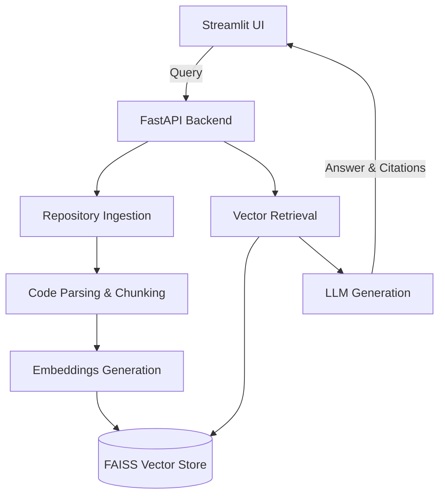

# CodeBase RAG

AI-Powered GitHub Repository Understanding Assistant. This application allows a user to provide a public GitHub repository URL or upload a ZIP repository and then ask natural-language questions about the codebase.

## Features
- Ingest GitHub repositories or ZIP uploads
- Extract and chunk code smartly using structure-aware parsing
- Search for relevant context using vector embeddings (FAISS)
- Chat with the codebase using various LLM providers (Gemini, OpenAI, Groq, Ollama)
- Detailed source citations indicating exactly where answers come from

## Architecture



## Setup

1. **Install dependencies:**
   ```bash
   pip install -r requirements.txt
   ```

2. **Configuration:**
   Copy `.env.example` to `.env` and fill in your API keys:
   ```bash
   cp .env.example .env
   ```

3. **Run Backend:**
   ```bash
   uvicorn backend.main:app --reload --port 8000
   ```

4. **Run Frontend:**
   ```bash
   streamlit run frontend/app.py
   ```
