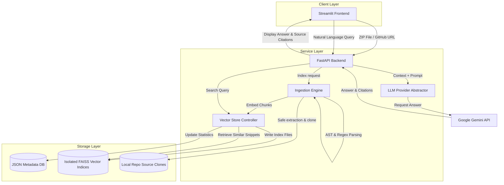

# CodeBase RAG — AI-Powered GitHub Repository Understanding Assistant

CodeBase RAG is a production-grade, local Retrieval-Augmented Generation (RAG) application that allows developers, security auditors, and system architects to quickly analyze, navigate, and chat with massive codebases. Provide a public GitHub repository link or upload a local ZIP file, and instantly ask natural-language questions about logic flows, file interactions, configurations, or coding details.

---

## 🏗️ Architecture Flow



---

## ✨ Features

- **🌐 Double-Ingestion Entry**: Direct cloning of public GitHub repositories or rapid processing of uploaded local `.zip` file code archives.
- **🛡️ Secure Processing Pipeline**: Strictly checks paths during extraction to prevent "ZipSlip" directory traversal exploits, filters binary formats, ignores database caches, and omits private configurations (`.env`, `.git`, `venv`, etc.).
- **🧩 Structure-Aware Code Parsing**: Splits code based on structural entities (classes, methods, functions) using AST for Python and robust pattern parsing for TypeScript/JavaScript/C++/Java/Rust/Go. Fallback to line-range chunking for general text documents.
- **⚡ Local Vector Storage (FAISS)**: Uses separate, isolated physical FAISS indexes for each repository to guarantee data isolation and prevent cross-contamination.
- **🧠 Local Sentence-Embeddings**: Computes semantic vectors locally using Hugging Face's `BAAI/bge-small-en-v1.5` transformer model, removing reliance on paid embedding APIs.
- **💬 Citation-Enriched LLM Answers**: Responses include precise source markers detailing the file paths, line ranges, matching symbol definitions, and match scores.

---

## 🛠️ Tech Stack

- **Backend Framework:** FastAPI (Uvicorn ASGI)
- **Frontend UI:** Streamlit
- **Vector Search Engine:** FAISS (Facebook AI Similarity Search)
- **Embeddings Model:** `BAAI/bge-small-en-v1.5` (via `sentence-transformers`)
- **LLM SDK:** `google-genai` (Migrated to the latest official Google GenAI package)
- **Default LLM:** `gemini-2.5-flash`

---

## 📁 Repository Directory Structure

```text
codebase-rag/
├── backend/
│   ├── api/
│   │   ├── chat.py             # Chat querying and retrieval pipeline
│   │   ├── health.py           # Server health state API
│   │   └── repository.py       # Clone/extract, parse, and index workflows
│   ├── embeddings/
│   │   └── embedding_service.py # Thread-safe singleton for local text embedding
│   ├── ingestion/
│   │   ├── chunker.py          # Smarter document chunking strategies
│   │   ├── file_filter.py      # Extension mappings and binary ignore exclusions
│   │   ├── github_loader.py    # GitPython repository cloning wrappers
│   │   ├── parser.py           # Python AST and language structure extractors
│   │   └── zip_loader.py       # Explode code ZIPs safely (ZipSlip validation)
│   ├── llm/
│   │   ├── prompts.py          # Context-aware prompts and system rules
│   │   └── provider.py         # Unified wrapper for Google GenAI calls
│   ├── models/
│   │   ├── request.py          # Pydantic schemas for API inputs
│   │   └── response.py         # Pydantic schemas for API outputs
│   ├── storage/
│   │   └── metadata_store.py   # Persistent JSON DB tracking indexed repo stats
│   ├── utils/
│   │   ├── config.py           # Configuration values loaded from environment
│   │   └── logger.py           # Central logging setup
│   └── main.py                 # FastAPI application startup entry point
├── frontend/
│   └── app.py                  # Polished Streamlit UI code
├── data/                       # Local volume storing indexes and cloned code
├── Dockerfile                  # Container build instructions
├── docker-compose.yml          # Container configuration manifest
├── requirements.txt            # Python library declarations
└── .env                        # Local secret configurations
```

---

## ⚙️ Configuration (.env)

Duplicate `.env.example` to `.env` and fill in the values:

```env
# LLM Configuration
LLM_PROVIDER=gemini
LLM_MODEL=gemini-2.5-flash
LLM_API_KEY=AIzaSy...             # Your Google AI Studio API Key

# Embedding Configuration
EMBEDDING_MODEL=BAAI/bge-small-en-v1.5

# Retrieval Configuration
TOP_K=10
ENABLE_RERANKER=false

# Storage Locations
DATA_DIR=./data
```

---

## 🚀 Setup & Execution

### Option A: Local Run (Recommended for Dev)

#### 1. Setup Virtual Environment & Install Dependencies
```powershell
# Create environment
python -m venv .venv

# Activate environment (Windows PowerShell)
.\.venv\Scripts\Activate.ps1

# Upgrade pip and install libraries
pip install --upgrade pip
pip install -r requirements.txt
```

#### 2. Start the Backend API (Terminal 1)
```powershell
.\.venv\Scripts\Activate.ps1
uvicorn backend.main:app --reload --port 8000
```

#### 3. Start the Streamlit UI (Terminal 2)
```powershell
.\.venv\Scripts\Activate.ps1
streamlit run frontend/app.py
```
Open your browser and navigate to `http://localhost:8501`.

---

## 📡 API Endpoints

### Repository API

* **`POST /repository/index`**
  * Input: `{"repo_url": "https://github.com/user/repo"}`
  * Description: Starts background indexing for a public Git repository.
* **`POST /repository/upload`**
  * Input: Multipart ZIP File Form Upload
  * Description: Unzips, parses, and indexes code files in a folder structure.
* **`GET /repository/`**
  * Description: List all currently indexed repositories and statistics.
* **`DELETE /repository/{id}`**
  * Description: Safely deletes local code clones and its FAISS vector indices from disk.

### Chat API

* **`POST /chat/`**
  * Input: `{"repository_id": "...", "query": "..."}`
  * Description: Queries the vector store, retrieves code context, constructs prompts, and generates the LLM response with file sources.
